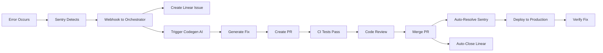

# Sentry Webhook Setup Guide

Complete guide for configuring Sentry webhooks for automated error tracking and resolution.

## 📋 Overview

Sentry webhooks enable real-time error notifications and automatic issue resolution as part of the closed-loop automation system.

**Webhook Endpoint**: `https://your-app.vercel.app/api/webhooks/orchestrator`

### Key Features

- **Real-time error notifications** when issues occur in production
- **Auto-create Linear issues** for critical errors
- **Trigger Codegen AI fixes** automatically
- **Auto-resolve issues** when fixes are deployed
- **Bi-directional sync** with Linear and GitHub

## Webhook Events

### Event Types

| Event | Description | Auto-Actions |
|-------|-------------|--------------|
| `error.created` | New error group created | Create Linear issue, trigger Codegen fix |
| `issue.created` | Issue state changed to unresolved | Escalate to team |
| `issue.resolved` | Issue marked as resolved | Close Linear issue |
| `issue.ignored` | Issue ignored | Update Linear status |
| `issue.assigned` | Issue assigned to user | Notify assignee |
| `event.created` | New error event | Increment counter, check thresholds |
| `event.alert` | Alert condition triggered | Send notifications |

### Event Payload Example

```json
{
  "action": "created",
  "installation": {
    "uuid": "installation-uuid"
  },
  "data": {
    "issue": {
      "id": "12345",
      "shareId": "abc123",
      "shortId": "PROJECT-123",
      "title": "TypeError: Cannot read property 'foo' of undefined",
      "culprit": "app/api/endpoint/route.ts in handler",
      "permalink": "https://sentry.io/organizations/org/issues/12345/",
      "logger": null,
      "level": "error",
      "status": "unresolved",
      "statusDetails": {},
      "isPublic": false,
      "platform": "javascript",
      "project": {
        "id": "67890",
        "name": "production-app",
        "slug": "production-app"
      },
      "type": "error",
      "metadata": {
        "type": "TypeError",
        "value": "Cannot read property 'foo' of undefined",
        "filename": "app/api/endpoint/route.ts"
      },
      "numComments": 0,
      "assignedTo": null,
      "isBookmarked": false,
      "isSubscribed": true,
      "subscriptionDetails": null,
      "hasSeen": false,
      "annotations": [],
      "issueType": "error",
      "issueCategory": "error",
      "priority": "high",
      "priorityLockedAt": null,
      "isUnhandled": true,
      "count": "1",
      "userCount": 1,
      "firstSeen": "2024-11-15T12:00:00.000000Z",
      "lastSeen": "2024-11-15T12:00:00.000000Z"
    },
    "event": {
      "event_id": "event-uuid",
      "level": "error",
      "version": "7",
      "type": "error",
      "logentry": {
        "formatted": "TypeError: Cannot read property 'foo' of undefined"
      },
      "logger": "",
      "modules": {},
      "platform": "javascript",
      "timestamp": 1700053200.0,
      "received": 1700053200.0,
      "environment": "production",
      "user": {
        "id": "user-123",
        "email": "user@example.com",
        "username": "user123",
        "ip_address": "192.168.1.1"
      },
      "request": {
        "url": "https://app.example.com/api/endpoint",
        "method": "POST",
        "headers": [
          ["User-Agent", "Mozilla/5.0..."],
          ["Referer", "https://app.example.com/"]
        ]
      },
      "contexts": {
        "browser": {
          "name": "Chrome",
          "version": "119.0.0"
        },
        "os": {
          "name": "Mac OS X",
          "version": "10.15.7"
        }
      },
      "exception": {
        "values": [
          {
            "type": "TypeError",
            "value": "Cannot read property 'foo' of undefined",
            "mechanism": {
              "type": "generic",
              "handled": false
            },
            "stacktrace": {
              "frames": [
                {
                  "filename": "app/api/endpoint/route.ts",
                  "function": "handler",
                  "lineno": 42,
                  "colno": 10,
                  "context_line": "  const value = obj.foo.bar",
                  "in_app": true
                }
              ]
            }
          }
        ]
      },
      "tags": [
        ["environment", "production"],
        ["level", "error"],
        ["url", "https://app.example.com/api/endpoint"]
      ],
      "breadcrumbs": {
        "values": [
          {
            "timestamp": 1700053190.0,
            "type": "http",
            "category": "fetch",
            "data": {
              "method": "GET",
              "url": "/api/data"
            },
            "level": "info"
          }
        ]
      }
    }
  }
}
```

## Setup Instructions

### 1. Configure Sentry Webhook

```bash
# Via Sentry Dashboard
1. Go to Settings → Developer Settings → Internal Integrations
2. Click "Create New Integration"
3. Set Name: "Automation Orchestrator"
4. Set Webhook URL: https://your-app.vercel.app/api/webhooks/orchestrator
5. Permissions:
   - Event: Read
   - Issue & Event: Read & Write
   - Project: Read
   - Organization: Read
6. Webhooks:
   ✓ error
   ✓ issue
   ✓ event.alert
   ✓ comment
7. Click "Save Changes"
8. Copy the Client Secret (for signature verification)
9. Generate and copy Auth Token
```

### 2. Environment Variables

```bash
# Add to .env.local and Vercel
SENTRY_DSN=https://xxx@xxx.ingest.sentry.io/xxx
SENTRY_AUTH_TOKEN=sntrys_xxx  # From integration
SENTRY_ORG=your-org-slug
SENTRY_PROJECT=your-project-slug
SENTRY_WEBHOOK_SECRET=client-secret-from-integration
```

### 3. Verify Integration

```bash
# Test webhook endpoint
curl -X POST https://your-app.vercel.app/api/webhooks/orchestrator \
  -H "Content-Type: application/json" \
  -H "x-webhook-source: sentry" \
  -H "sentry-hook-signature: test" \
  -d '{
    "action": "created",
    "data": {
      "issue": {
        "id": "test",
        "title": "Test Error",
        "level": "error"
      }
    }
  }'

# Trigger test error in app
# This should create a Linear issue and trigger Codegen fix
```

## Automation Rules

### Current Auto-Actions

#### 1. Error Created → Linear Issue + Codegen Fix

```typescript
{
  trigger: {
    source: 'sentry',
    type: 'error.created',
    conditions: {
      level: ['error', 'fatal']
    }
  },
  actions: [
    {
      type: 'create_linear_issue',
      config: {
        priority: 1,  // Urgent
        labels: ['auto-generated', 'sentry-error'],
        assignTeam: true
      }
    },
    {
      type: 'trigger_codegen',
      config: {
        prompt: 'Analyze and fix this Sentry error',
        autoCreatePR: true
      }
    }
  ]
}
```

#### 2. PR Merged → Auto-Resolve Sentry Issues

```typescript
{
  trigger: {
    source: 'github',
    type: 'pull_request.closed',
    conditions: { merged: true }
  },
  actions: [
    {
      type: 'auto_resolve',
      config: {
        resolveSentryIssues: true,
        resolveLinearIssues: true,
        comment: 'Auto-resolved: PR merged successfully'
      }
    }
  ]
}
```

### Escalation Rules

```typescript
// Escalate based on severity and impact
const ESCALATION_RULES = {
  critical: {
    condition: "level === 'fatal' || userCount > 100",
    priority: 0,
    notify: ['@on-call', '@engineering-lead'],
    createIncident: true
  },
  high: {
    condition: "level === 'error' && userCount > 10",
    priority: 1,
    notify: ['@team'],
    createIncident: false
  },
  normal: {
    condition: "level === 'error'",
    priority: 2,
    notify: [],
    createIncident: false
  }
}
```

## Auto-Resolution Workflow

### Complete Closed-Loop



### Implementation

```typescript
// In app/api/webhooks/orchestrator/route.ts
async function resolveSentryIssue(
  issueId: string,
  comment: string
): Promise<any> {
  const SENTRY_AUTH_TOKEN = process.env.SENTRY_AUTH_TOKEN
  const SENTRY_ORG = process.env.SENTRY_ORG
  const SENTRY_PROJECT = process.env.SENTRY_PROJECT

  if (!SENTRY_AUTH_TOKEN) {
    console.warn('[Orchestrator] SENTRY_AUTH_TOKEN not configured')
    return null
  }

  const response = await fetch(
    `https://sentry.io/api/0/projects/${SENTRY_ORG}/${SENTRY_PROJECT}/issues/${issueId}/`,
    {
      method: 'PUT',
      headers: {
        'Authorization': `Bearer ${SENTRY_AUTH_TOKEN}`,
        'Content-Type': 'application/json'
      },
      body: JSON.stringify({
        status: 'resolved',
        statusDetails: { comment }
      })
    }
  )

  if (!response.ok) {
    console.error('[Orchestrator] Failed to resolve Sentry issue:', await response.text())
    return null
  }

  const data = await response.json()
  console.log(`[Orchestrator] Resolved Sentry issue: ${issueId}`)
  return data
}
```

## Integration with Linear

### Linking Issues

```typescript
// Extract Sentry issue ID from Linear description
function extractSentryIssues(linearDescription: string): string[] {
  const sentryUrlPattern = /sentry\.io\/.*\/issues\/(\d+)/g
  const matches = [...linearDescription.matchAll(sentryUrlPattern)]
  return matches.map(m => m[1])
}

// Add Sentry link to Linear issue
async function addSentryLinkToLinear(
  linearIssueId: string,
  sentryIssueUrl: string
): Promise<void> {
  const mutation = `
    mutation IssueUpdate($id: String!, $description: String!) {
      issueUpdate(id: $id, input: { description: $description }) {
        success
      }
    }
  `

  const currentIssue = await getLinearIssue(linearIssueId)
  const updatedDescription = `${currentIssue.description}\n\n**Sentry Issue**: ${sentryIssueUrl}`

  await fetch('https://api.linear.app/graphql', {
    method: 'POST',
    headers: {
      'Authorization': process.env.LINEAR_API_KEY!,
      'Content-Type': 'application/json'
    },
    body: JSON.stringify({
      query: mutation,
      variables: {
        id: linearIssueId,
        description: updatedDescription
      }
    })
  })
}
```

## Monitoring & Alerts

### Error Thresholds

```typescript
// Configure alert thresholds
const ALERT_THRESHOLDS = {
  error_rate: {
    threshold: 10,  // errors per minute
    window: '1m',
    action: 'create_incident'
  },
  unique_errors: {
    threshold: 5,  // new error types
    window: '5m',
    action: 'notify_team'
  },
  user_impact: {
    threshold: 100,  // affected users
    window: '15m',
    action: 'page_on_call'
  }
}
```

### Health Dashboard

Track key metrics:

- **MTTR** (Mean Time To Resolution): Time from error to fix deployed
- **Error Rate**: Errors per minute/hour
- **Auto-Fix Success Rate**: % of errors fixed automatically
- **Manual Intervention Rate**: % requiring human input

### Sentry Performance Monitoring

```javascript
// Configure performance monitoring
Sentry.init({
  dsn: process.env.SENTRY_DSN,
  environment: process.env.NODE_ENV,
  tracesSampleRate: 1.0,  // 100% in production
  profilesSampleRate: 1.0,
  integrations: [
    new Sentry.BrowserTracing(),
    new Sentry.Replay({
      maskAllText: true,
      blockAllMedia: true,
    }),
  ],
  beforeSend(event, hint) {
    // Enrich event with additional context
    event.tags = {
      ...event.tags,
      automation: 'enabled',
      auto_fix: 'true'
    }
    return event
  }
})
```

## Troubleshooting

### Webhook Not Firing

```bash
# Check Sentry integration status
1. Go to Settings → Integrations → Internal Integrations
2. Click your integration
3. Check "Webhook Deliveries" tab
4. Look for failed deliveries

# Verify webhook URL
curl https://your-app.vercel.app/api/webhooks/orchestrator

# Check Vercel logs
vercel logs --production --follow | grep sentry
```

### Issues Not Auto-Resolving

```bash
# Verify SENTRY_AUTH_TOKEN has correct permissions
# Required: issue:write, project:read

# Test manual resolution
curl -X PUT https://sentry.io/api/0/projects/ORG/PROJECT/issues/ISSUE_ID/ \
  -H "Authorization: Bearer ${SENTRY_AUTH_TOKEN}" \
  -H "Content-Type: application/json" \
  -d '{"status":"resolved"}'

# Check orchestrator logs for errors
vercel logs --production | grep "resolveSentryIssue"
```

### False Positives

```bash
# Configure issue filtering in Sentry
# Settings → Processing → Inbound Filters
# Add rules to ignore:
# - Known browser extensions
# - Development errors
# - Third-party script errors
# - Bot traffic

# Or filter in orchestrator
function shouldProcessError(event: SentryEvent): boolean {
  // Ignore development errors
  if (event.environment === 'development') return false

  // Ignore low-level warnings
  if (event.level === 'warning' || event.level === 'info') return false

  // Ignore third-party errors
  const isThirdParty = event.exception?.values?.some(
    e => !e.stacktrace?.frames?.some(f => f.in_app)
  )
  if (isThirdParty) return false

  return true
}
```

## Security Best Practices

### 1. Signature Verification

```typescript
import crypto from 'crypto'

function verifySentrySignature(
  payload: string,
  signature: string,
  secret: string
): boolean {
  const hmac = crypto.createHmac('sha256', secret)
  hmac.update(payload, 'utf8')
  const digest = hmac.digest('hex')
  return crypto.timingSafeEqual(
    Buffer.from(signature),
    Buffer.from(digest)
  )
}

// In webhook handler
const signature = req.headers.get('sentry-hook-signature')
const body = await req.text()
const isValid = verifySentrySignature(
  body,
  signature,
  process.env.SENTRY_WEBHOOK_SECRET!
)

if (!isValid) {
  return Response.json({ error: 'Invalid signature' }, { status: 401 })
}
```

### 2. PII Scrubbing

```javascript
// Configure in sentry.client.config.ts
Sentry.init({
  beforeSend(event) {
    // Remove sensitive data
    if (event.request) {
      delete event.request.cookies
      delete event.request.headers?.Authorization
    }

    if (event.user) {
      delete event.user.email
      delete event.user.ip_address
    }

    return event
  }
})
```

### 3. Rate Limiting

```typescript
// Prevent webhook spam
const sentryRateLimit = new Map<string, number>()

function checkSentryRateLimit(issueId: string): boolean {
  const now = Date.now()
  const lastSeen = sentryRateLimit.get(issueId) || 0

  // Allow max 1 webhook per issue per minute
  if (now - lastSeen < 60000) {
    return false
  }

  sentryRateLimit.set(issueId, now)
  return true
}
```

## Resources

- **Sentry Webhooks**: https://docs.sentry.io/product/integrations/integration-platform/webhooks/
- **Sentry API**: https://docs.sentry.io/api/
- **Issue Templates**: `.linear/templates/sentry-error-issue.yaml`
- **Orchestrator**: `app/api/webhooks/orchestrator/route.ts`

---

**🤖 Part of the Closed-Loop Automation System**
**⚡️ Real-time Error Tracking & Auto-Resolution**
