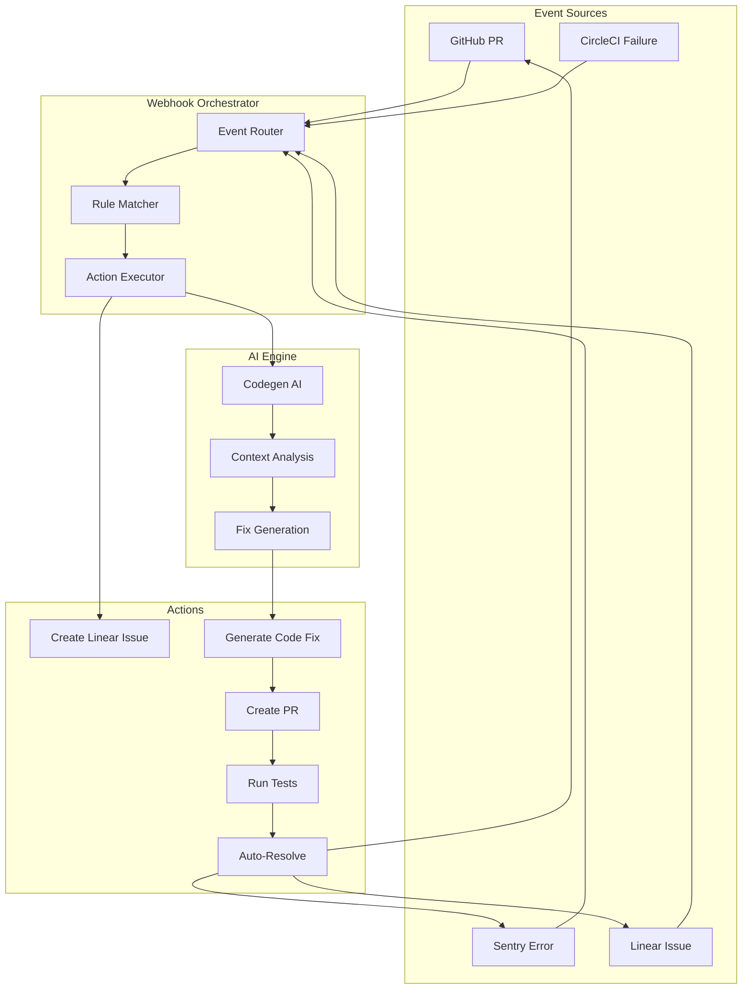
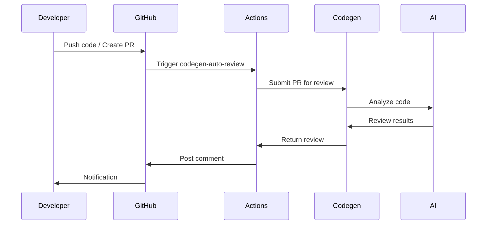
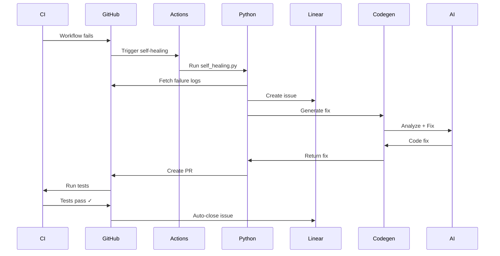
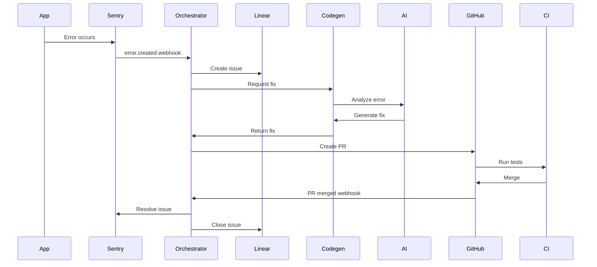
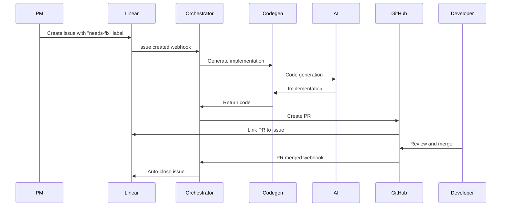

# Closed-Loop AI Automation System

> Complete guide to the autonomous AI agent automation system integrating Codegen, Linear, CircleCI, GitHub, and Sentry

## 🎯 Overview

This system implements a **fully autonomous, closed-loop workflow** where AI agents detect issues, generate fixes, create pull requests, and automatically resolve issues when fixes are deployed - all without human intervention.

### Key Capabilities

- **🤖 Autonomous Code Review**: AI reviews every PR automatically
- **🔧 Self-Healing CI/CD**: Detects failures and generates fixes automatically
- **🐛 Auto-Fix Production Errors**: Sentry errors trigger automatic fixes
- **🔄 Closed-Loop Resolution**: Issues auto-resolve when fixes merge
- **📊 Real-time Monitoring**: Health checks and metrics tracking
- **🔗 Bi-directional Sync**: Linear ↔ GitHub ↔ Sentry ↔ CircleCI

### Architecture Diagram



## 📚 Table of Contents

- [Setup](#setup)
- [Components](#components)
- [Workflows](#workflows)
- [Configuration](#configuration)
- [Usage](#usage)
- [Monitoring](#monitoring)
- [Troubleshooting](#troubleshooting)

## 🚀 Setup

### Prerequisites

- Node.js 18+ and npm
- Python 3.8+ (for automation scripts)
- Git repository with GitHub Actions enabled
- Accounts: Codegen, Linear, Sentry, CircleCI (optional)

### Step 1: Environment Variables

```bash
# Copy example and configure
cp .env.example .env.local

# Required for full automation:
CODEGEN_API_KEY=xxx
CODEGEN_ORG_ID=xxx
LINEAR_API_KEY=lin_api_xxx
LINEAR_WEBHOOK_SECRET=xxx
SENTRY_DSN=xxx
SENTRY_AUTH_TOKEN=xxx
SENTRY_WEBHOOK_SECRET=xxx
GITHUB_TOKEN=ghp_xxx
```

**Get credentials**:
- **Codegen**: https://app.codegen.com/settings/api-keys
- **Linear**: https://linear.app/settings/api
- **Sentry**: Settings → Developer Settings → Internal Integrations
- **GitHub**: Settings → Developer settings → Personal access tokens

### Step 2: Configure Webhooks

#### Linear Webhook

```bash
1. Go to Linear → Settings → API → Webhooks
2. Create new webhook
3. URL: https://your-app.vercel.app/api/webhooks/orchestrator
4. Resource types: Issue, Comment, Project
5. Copy signing secret to LINEAR_WEBHOOK_SECRET
```

#### Sentry Webhook

```bash
1. Sentry → Settings → Developer Settings → Internal Integrations
2. Create new integration
3. Webhook URL: https://your-app.vercel.app/api/webhooks/orchestrator
4. Permissions: Issue & Event (Read & Write)
5. Subscribe to: error, issue
6. Copy client secret to SENTRY_WEBHOOK_SECRET
7. Generate and copy auth token to SENTRY_AUTH_TOKEN
```

### Step 3: Configure GitHub Secrets

```bash
# Add secrets to GitHub repository
gh secret set CODEGEN_API_KEY
gh secret set CODEGEN_ORG_ID
gh secret set LINEAR_API_KEY
gh secret set SENTRY_DSN
gh secret set SENTRY_AUTH_TOKEN
gh secret set SENTRY_ORG
gh secret set SENTRY_PROJECT
gh secret set CIRCLECI_API_TOKEN  # Optional
```

### Step 4: Deploy to Vercel

```bash
# Configure environment variables in Vercel dashboard
vercel env add CODEGEN_API_KEY
vercel env add CODEGEN_ORG_ID
vercel env add LINEAR_API_KEY
vercel env add LINEAR_WEBHOOK_SECRET
vercel env add SENTRY_AUTH_TOKEN
vercel env add SENTRY_WEBHOOK_SECRET

# Deploy
vercel --prod
```

### Step 5: Verify Setup

```bash
# Test webhook endpoint
curl -X POST https://your-app.vercel.app/api/webhooks/orchestrator \
  -H "Content-Type: application/json" \
  -H "x-webhook-source: test" \
  -d '{"test": true}'

# Should return: {"received": true, ...}

# Test health checks
node .github/scripts/health-check.js

# Should show all services healthy
```

## 🧩 Components

### 1. GitHub Actions Workflows

**Location**: `.github/workflows/`

#### Codegen Auto-Review (`codegen-auto-review.yml`)

Triggers on every PR, performs AI code review.

```yaml
Triggers: PR opened, synchronized, reopened
Actions:
  - Fetch PR diff
  - Submit to Codegen AI for analysis
  - Post review results as PR comment
  - Block merge if critical issues found
```

**Key features**:
- Skips draft PRs and dependabot
- Comprehensive review (security, performance, quality)
- Actionable feedback with code snippets
- Configurable severity thresholds

#### Self-Healing CI/CD (`self-healing-ci.yml`)

Triggers when CI failures occur, automatically generates fixes.

```yaml
Triggers: workflow_run completion (failures)
Actions:
  - Analyze failure logs
  - Create Linear issue for tracking
  - Trigger Codegen AI fix
  - Create PR with fix
  - Run health checks
  - Report to Sentry on critical failures
```

**Key features**:
- Automatic failure detection
- Context-aware fix generation
- Auto-creates fix PR with tests
- Health check integration
- Sentry error reporting

### 2. Python Automation Scripts

**Location**: `.github/scripts/`

#### `codegen_review.py`

Performs AI code review via Codegen API.

```python
Functions:
  - get_pr_diff(): Fetch PR changes from GitHub
  - create_codegen_task(): Submit review task
  - check_task_status(): Poll for completion
  - post_review_comment(): Add results to PR

Flow: Fetch diff → Analyze → Generate review → Post comment
```

#### `self_healing.py`

Orchestrates self-healing workflow.

```python
Functions:
  - get_workflow_logs(): Fetch GitHub Actions logs
  - parse_failure_context(): Extract errors, files
  - create_linear_issue(): Track in Linear
  - create_codegen_fix(): Generate AI fix
  - wait_for_completion(): Monitor task

Flow: Fetch logs → Parse errors → Create issue → Generate fix → Wait → Output
```

#### `circleci_auto_fix.py`

CircleCI-specific auto-fix integration.

```python
Functions:
  - get_failed_job_logs(): Fetch CircleCI logs
  - create_auto_fix_task(): Submit to Codegen

Flow: Fetch CircleCI logs → Analyze → Generate fix
```

### 3. Health Check Script

**Location**: `.github/scripts/health-check.js`

Node.js script for system health monitoring.

```javascript
Checks:
  - R2R Agent (critical)
  - R2R Dashboard
  - Hatchet Workflow

Output: JSON health report + exit code (0=ok, 1=critical)
```

### 4. Webhook Orchestrator

**Location**: `app/api/webhooks/orchestrator/route.ts`

Edge function processing webhooks from all sources.

```typescript
Handles:
  - Sentry error.created → Linear issue + Codegen fix
  - Linear issue.created → Codegen implementation
  - GitHub PR merged → Auto-resolve Linear + Sentry
  - CircleCI workflow failed → Auto-fix

Processing:
  1. Verify webhook signature
  2. Parse event payload
  3. Match automation rules
  4. Execute actions (parallel)
  5. Return execution results
```

### 5. Linear Issue Templates

**Location**: `.linear/templates/`

YAML templates for automated issue creation.

- **`ci-failure-issue.yaml`**: CI/CD failures
- **`sentry-error-issue.yaml`**: Production errors
- **`security-vulnerability-issue.yaml`**: Security issues

**Features**:
- Pre-configured priorities and labels
- Auto-assignment rules
- State transition automation
- SLA tracking
- Integration actions

### 6. CircleCI Configuration

**Location**: `.circleci/config.yml`

Updated with `auto-fix-failures` job.

```yaml
auto-fix-failures:
  when: on_fail  # Runs only on failures
  steps:
    - Setup Python
    - Run circleci_auto_fix.py
    - Trigger Codegen AI fix
```

## 🔄 Workflows

### Workflow 1: Auto Code Review



**Timeline**: ~2-5 minutes

**Output**: PR comment with detailed review, code suggestions, security findings

### Workflow 2: Self-Healing CI Failure



**Timeline**: ~5-15 minutes

**Output**: New PR with fix, Linear issue, health report

### Workflow 3: Production Error Auto-Fix



**Timeline**: ~10-20 minutes end-to-end

**Output**: Fixed error, resolved Sentry issue, closed Linear issue

### Workflow 4: Linear Issue Implementation



**Timeline**: ~5-10 minutes

**Output**: Implementation PR linked to Linear issue

## ⚙️ Configuration

### Automation Rules

Edit `app/api/webhooks/orchestrator/route.ts` to modify automation rules.

#### Example: Add Custom Rule

```typescript
{
  id: 'custom-security-alert',
  trigger: {
    source: 'github',
    type: 'code_scanning_alert.created',
    conditions: {
      severity: 'critical'
    }
  },
  actions: [
    {
      type: 'create_linear_issue',
      config: {
        priority: 0,  // Critical
        labels: ['security', 'urgent']
      }
    },
    {
      type: 'trigger_codegen',
      config: {
        prompt: 'Fix this security vulnerability immediately',
        autoCreatePR: true
      }
    },
    {
      type: 'notify',
      config: {
        channel: 'slack',
        severity: 'critical',
        mention: '@security-team'
      }
    }
  ]
}
```

### Environment Configuration

`.env.local` settings for fine-tuning:

```bash
# Auto-fix behavior
AUTO_FIX_CREATE_PR=true
AUTO_FIX_AUTO_MERGE=false  # Require human review

# Auto-review thresholds
AUTO_REVIEW_MIN_FILES_CHANGED=1
AUTO_REVIEW_SKIP_DRAFTS=true

# Self-healing
SELF_HEALING_MAX_RETRIES=3
SELF_HEALING_RETRY_DELAY_MS=5000

# Codegen timeouts
CODEGEN_MAX_TASK_WAIT_TIME=600000  # 10 minutes
```

### Linear Template Customization

Edit `.linear/templates/*.yaml` to customize:

- Issue priorities
- Label schemes
- Auto-assignment rules
- State transitions
- SLA targets

### CircleCI Job Configuration

`.circleci/config.yml` - modify `auto-fix-failures` job:

```yaml
auto-fix-failures:
  executor: node-executor
  steps:
    - checkout
    - attach_workspace:
        at: .
    - run:
        name: Setup Python
        command: |
          sudo apt-get update
          sudo apt-get install -y python3 python3-pip
          pip3 install requests
    - run:
        name: Trigger Auto-fix
        command: python3 .github/scripts/circleci_auto_fix.py
        environment:
          CODEGEN_ORG_ID: ${CODEGEN_ORG_ID}
          CODEGEN_API_KEY: ${CODEGEN_API_KEY}
        when: on_fail  # Only run on failures
```

## 📖 Usage

### Manual Triggering

#### Trigger Auto-Review

```bash
# Via GitHub UI: Open PR normally
# Auto-review runs automatically

# Or trigger manually via API
gh api repos/:owner/:repo/dispatches \
  -F event_type=codegen-review \
  -F client_payload[pr_number]=123
```

#### Trigger Self-Healing

```bash
# Trigger by making a commit that fails CI
git commit --allow-empty -m "test: trigger self-healing"
git push

# Or trigger manually
gh workflow run self-healing-ci.yml
```

#### Create Auto-Fix Issue in Linear

```bash
# Create issue with "needs-fix" label
# Automation triggers automatically
```

### Monitoring Active Tasks

```bash
# View Codegen tasks
# Visit: https://app.codegen.com/tasks

# View Linear issues
# Visit: https://linear.app/your-team/issues

# View GitHub PRs
gh pr list --label auto-fix

# View Sentry issues
# Visit: https://sentry.io/organizations/your-org/issues
```

### Manual Overrides

```bash
# Disable auto-fix temporarily
# Set in Vercel environment:
AUTO_FIX_ENABLED=false

# Disable auto-review
AUTO_REVIEW_ENABLED=false

# Disable webhook orchestrator
WEBHOOK_ORCHESTRATOR_ENABLED=false
```

## 📊 Monitoring

### Metrics Dashboard

Track key metrics:

- **MTTR** (Mean Time To Resolution): Target < 1 hour
- **Auto-Fix Success Rate**: Target > 80%
- **Manual Intervention Rate**: Target < 20%
- **PR Merge Time**: Target < 2 hours
- **CI Failure Rate**: Trending down

### Logs

```bash
# Vercel production logs
vercel logs --production --follow

# Filter by automation
vercel logs --production | grep "Orchestrator"
vercel logs --production | grep "self-healing"

# GitHub Actions logs
gh run list
gh run view <run-id>
```

### Health Checks

```bash
# Run health check manually
node .github/scripts/health-check.js

# Check specific service
curl http://136.119.36.216:7272/v3/health  # R2R
curl http://136.119.36.216:7273  # R2R Dashboard
curl http://136.119.36.216:7274  # Hatchet

# Webhook endpoint health
curl https://your-app.vercel.app/api/webhooks/orchestrator
```

### Alerts & Notifications

Configure in `.env.local`:

```bash
# Slack notifications
SLACK_WEBHOOK_URL=https://hooks.slack.com/services/xxx
SLACK_CHANNEL_CI_ALERTS=#ci-alerts
NOTIFY_ON_AUTO_FIX=true

# Critical error notifications
NOTIFY_ON_CRITICAL_ERROR=true
```

## 🐛 Troubleshooting

### Issue: Webhooks Not Firing

**Symptoms**: No automation triggered despite events

**Solutions**:
```bash
# 1. Verify webhook endpoints
curl https://your-app.vercel.app/api/webhooks/orchestrator

# 2. Check webhook delivery logs
# Linear: Settings → API → Webhooks → Deliveries
# Sentry: Integration → Webhook Deliveries

# 3. Verify signatures
echo $LINEAR_WEBHOOK_SECRET
echo $SENTRY_WEBHOOK_SECRET

# 4. Check Vercel logs
vercel logs --production | grep webhook
```

### Issue: Auto-Fix Not Creating PRs

**Symptoms**: Fix generated but no PR

**Solutions**:
```bash
# 1. Check GITHUB_TOKEN permissions
# Required: repo, workflow, write:packages

# 2. Verify Codegen task completed
# Visit: https://app.codegen.com/tasks/<task-id>

# 3. Check self-healing script output
cat /tmp/self_healing_result.json

# 4. Manually trigger PR creation
gh pr create --title "Auto-fix" --body "..."
```

### Issue: Rate Limiting

**Symptoms**: 429 errors, webhooks failing

**Solutions**:
```bash
# 1. Check API rate limits
gh api rate_limit  # GitHub
curl -H "Authorization: Bearer $LINEAR_API_KEY" https://api.linear.app/graphql  # Linear

# 2. Implement exponential backoff (already in retry.ts)

# 3. Reduce webhook frequency
# Filter events in webhook configuration
```

### Issue: Tests Failing in Auto-Fix PRs

**Symptoms**: Auto-generated fixes fail CI

**Solutions**:
```bash
# 1. Review Codegen prompt
# Add more context about tests

# 2. Include test files in prompt context
# Edit self_healing.py or codegen_review.py

# 3. Manual review required
# Set AUTO_FIX_AUTO_MERGE=false
```

### Issue: Circular Automation Loops

**Symptoms**: Automation triggers itself repeatedly

**Solutions**:
```bash
# 1. Add [skip ci] to auto-fix commits
# Already implemented in scripts

# 2. Filter auto-generated events
# In orchestrator, check:
if (event.data.author === 'github-actions[bot]') return

# 3. Add cooldown period
# Track last automation run time per issue
```

## 📚 References

### Documentation

- [Codegen Documentation](https://docs.codegen.com)
- [Linear API](https://developers.linear.app/docs)
- [Sentry Webhooks](https://docs.sentry.io/product/integrations/integration-platform/webhooks/)
- [GitHub Actions](https://docs.github.com/en/actions)

### Internal Docs

- [Linear Webhook Setup](.linear/WEBHOOK_SETUP.md)
- [Sentry Webhook Setup](.sentry/WEBHOOK_SETUP.md)
- [R2R Configuration](R2R_AGENT_CONFIG_GUIDE.md)

### Related Files

```text
.github/
├── workflows/
│   ├── codegen-auto-review.yml       # Auto code review
│   └── self-healing-ci.yml           # Self-healing CI/CD
└── scripts/
    ├── codegen_review.py             # Code review logic
    ├── self_healing.py               # Self-healing logic
    ├── circleci_auto_fix.py          # CircleCI integration
    └── health-check.js               # Health monitoring

app/api/webhooks/
└── orchestrator/
    └── route.ts                       # Central webhook handler

.linear/
├── templates/                         # Issue templates
│   ├── ci-failure-issue.yaml
│   ├── sentry-error-issue.yaml
│   └── security-vulnerability-issue.yaml
└── WEBHOOK_SETUP.md                   # Linear webhook guide

.sentry/
└── WEBHOOK_SETUP.md                   # Sentry webhook guide

.circleci/
└── config.yml                         # CircleCI with auto-fix

docs/
└── AUTOMATION.md                      # This file
```

## 🎯 Best Practices

### 1. Security

- ✅ Always verify webhook signatures
- ✅ Rotate API keys regularly
- ✅ Use environment variables, never commit secrets
- ✅ Implement rate limiting
- ✅ Sanitize all webhook inputs

### 2. Reliability

- ✅ Implement retry logic with exponential backoff
- ✅ Handle errors gracefully, don't crash
- ✅ Log all automation actions
- ✅ Monitor success/failure rates
- ✅ Have manual override capabilities

### 3. Maintainability

- ✅ Keep automation rules simple and testable
- ✅ Document all custom rules
- ✅ Version control all configurations
- ✅ Regular audits of automation effectiveness
- ✅ Clean up stale issues and PRs

### 4. Performance

- ✅ Run actions in parallel where possible
- ✅ Set reasonable timeouts
- ✅ Cache API responses when appropriate
- ✅ Batch operations to reduce API calls
- ✅ Monitor and optimize slow operations

## 🚀 What's Next

### Planned Enhancements

- [ ] Slack integration for notifications
- [ ] Advanced analytics dashboard
- [ ] ML-powered priority prediction
- [ ] Auto-merge for low-risk PRs
- [ ] Codegen cost tracking and optimization
- [ ] Multi-repo support
- [ ] Custom AI model fine-tuning

### Contributing

To add new automation rules:

1. Edit `app/api/webhooks/orchestrator/route.ts`
2. Add rule to `AUTOMATION_RULES` array
3. Implement action handlers if needed
4. Test with manual webhook triggers
5. Document in this file
6. Submit PR for review

---

**🤖 Closed-Loop AI Automation System**
**⚡️ Autonomous • Self-Healing • Production-Ready**
**🔗 Powered by Codegen + Linear + GitHub + Sentry + CircleCI**
